# 🛡️ Security Maturity Assistant

> AI-powered security guidance for small-medium businesses

**[User Guide](./README.md)** | **[Evaluation Report](./backend/RAGAS_REPORT.md)**

---

## 📋 Table of Contents

- [Task 1: Defining the Problem and Audience](#task-1-defining-the-problem-and-audience)
- [Task 2: Proposed Solution](#task-2-proposed-solution)
- [Task 3: Dealing with the Data](#task-3-dealing-with-the-data)
- [Task 4: Building an End-to-End Agentic RAG Prototype](#task-4-building-an-end-to-end-agentic-rag-prototype)
- [Task 5: Creating a Golden Test Data Set](#task-5-creating-a-golden-test-data-set)
- [Task 6: The Benefits of Advanced Retrieval](#task-6-the-benefits-of-advanced-retrieval)
- [Task 7: Assessing Performance](#task-7-assessing-performance)
- [Evaluation Results Summary](#-evaluation-results-summary)

---

## Task 1: Defining the Problem and Audience

### Problem Statement
Small and medium businesses struggle to implement basic security practices due to overwhelming, expensive, and generic guidance that doesn't fit their limited budgets and IT resources.

### Why This is a Problem for SMBs

**60% of small businesses close within 6 months of a cyber attack**, yet implementing security is confusing and expensive for SMBs:

- **Overwhelming**: Security standards (CIS, NIST, OWASP) contain hundreds of controls—where do you start with 2 IT staff and no security expertise?
- **Expensive**: Security consultants cost $5K-$15K just for an assessment, putting proper guidance out of reach for businesses with $500-$2K monthly security budgets
- **Generic**: ChatGPT and online guides give one-size-fits-all advice that doesn't consider your tech stack (AWS vs Azure), industry (healthcare vs retail), or constraints (2-person IT team vs enterprise SOC)

**Real example**: A 25-person healthcare startup using AWS needs to secure patient data but doesn't know where to begin. Consultants quote $10K for a security roadmap. Free resources say "implement encryption" and "use MFA"—but which systems first? What tools fit our budget? How do we prioritize with limited time? The gap between "you need security" and "here's exactly what to do with your $2K budget and AWS environment" leaves SMBs vulnerable or wasting money on wrong priorities.

---

## Task 2: Proposed Solution

### How It Works for Users

**Two modes for different needs:**

1. **📊 Security Assessment** (5 minutes)
   - Answer 7 questions about your company (size, industry, tech stack, current security)
   - Get a security score (0-10) and maturity level
   - Receive top 5 critical gaps prioritized for YOUR situation
   - Example: "You're a 20-person AWS-based SaaS startup with just antivirus → Score 2.5/10 → Fix: MFA ($3/user), backups (AWS native), access logging"

2. **🔧 Implementation Helper** (instant)
   - Search any security topic: "Harden Windows Server 2022"
   - Get step-by-step guides with copy-paste commands
   - Based on CIS benchmarks, NIST guidelines, OWASP standards
   - Example: Search → Get PowerShell commands → Copy-paste → Done

**User experience**: Fast, specific, actionable. No consultant needed. No reading 500-page standards.

### Technical Stack

| Component | Technology | Why This Choice |
|-----------|------------|-----------------|
| **LLM** | OpenAI gpt-4o-mini | Cost-effective ($0.15/$0.60 per 1M tokens) while handling security content well; proven for technical Q&A |
| **Embeddings** | text-embedding-3-small | Extremely cheap ($0.02/1M tokens), 1536 dims sufficient for security doc semantics |
| **Orchestration** | LangGraph | Purpose-built for agentic workflows with state management; handles multi-step reasoning (analyze→research→generate) |
| **Vector DB** | Qdrant (self-hosted) | Open-source, Docker deployment, efficient filtering by metadata (document source, security framework) |
| **Monitoring** | LangSmith | Tracks agent reasoning chains and costs; critical for debugging why certain recommendations were made |
| **Evaluation** | RAGAS framework | Industry standard for RAG evaluation with metrics tailored to context relevance and faithfulness |
| **UI** | React + Vite + Tailwind | Fast dev/build, modern UX for forms and dashboards, instant HMR for iteration |
| **Backend** | FastAPI (Python) | Async support for concurrent requests, native PDF processing libraries, fast prototyping |

### Agentic Reasoning

**Where agents are used:**

1. **Assessment Agent**: Analyzes user profile (industry, size, tech) → Maps to CIS Implementation Groups → Identifies critical gaps → Prioritizes by risk/budget fit
2. **Research Agent**: User asks "How to harden Ubuntu?" → Agent searches vector DB for CIS benchmarks → Searches web (Tavily) for real examples → Synthesizes into guide
3. **Multi-step reasoning**: Question → Retrieve context → Validate against standards → Generate actionable steps → Cite sources

**Why agentic**: Security questions need both authoritative standards AND real-world implementation examples. Single-shot RAG misses nuance (e.g., "MFA" needs both NIST requirements AND "here's how to set up Duo for $3/user"). Agents orchestrate: retrieve standard → find implementation guide → match to user's tech stack → generate customized answer.

---

## Task 3: Dealing with the Data

### Data Sources

| Source | Purpose | Format |
|--------|---------|--------|
| **CIS Amazon Web Services Foundations Benchmark v6.0.0** | AWS security configuration guidance | PDF (ingested at startup) |
| **OWASP ASVS 5.0** | Web application security requirements | PDF (ingested at startup) |
| **User Input** | Company profile (size, industry, tech, budget, concerns) | JSON (form submission) |
| **Tavily Search API** | Real-time web search for implementation examples, tool recommendations, pricing | REST API (on-demand) |

**How they're used:**
- **Assessment mode**: User profile → LLM analyzes against CIS/OWASP → Identifies gaps → Retrieves relevant controls from vector DB → Generates personalized report
- **Implementation mode**: User query → Vector search in CIS/OWASP docs → Web search for examples → Synthesizes guide with commands

### Chunking Strategy

**Default**: RecursiveCharacterTextSplitter (1500 tokens, 200 overlap)

**Why this decision:**
- **Security docs have mixed structure**: Some sections are hierarchical (CIS controls with sub-controls), others are narrative (OWASP guidance). Recursive splitter handles both by trying logical breaks (headers, paragraphs) before character limits.
- **1500 tokens preserves context**: Security controls often span multiple paragraphs (description → implementation → verification). Too small = fragmented, too large = diluted relevance. 1500 tokens ≈ 1 complete control section.
- **200 overlap prevents boundary issues**: If "Step 5: Configure firewall" is split, overlap ensures the full context appears in at least one chunk.
- **Metadata preserved**: Each chunk tagged with source file, page, framework (CIS vs OWASP) for filtering during retrieval.

**Alternative considered but not used**: Control-based splitting (like ISO controls) doesn't work here because CIS/OWASP have inconsistent numbering schemes across documents. Recursive is more flexible.

---

## Task 4: Building an End-to-End Agentic RAG Prototype

### Architecture Overview

**RAG Pipeline** (`backend/utils/rag.py`):
```
User Query → Embedding (OpenAI) → Vector Search (Qdrant) 
→ Optional: BM25 + Cohere Reranking (advanced_retrieval.py)
→ Context + Query → LLM (gpt-4o-mini) → Answer + Sources
```

**Agentic Workflow** (`backend/utils/agents.py`):
```
User Input → LangGraph Orchestrator
  ├─ State: {query, company_context, retrieved_docs, web_results}
  ├─ Agent 1: Retrieval → Query vector DB → Update state
  ├─ Agent 2: Research → Call Tavily API → Update state  
  └─ Agent 3: Generation → Synthesize context → Return answer
```

**Key Files:**
- `backend/main.py`: FastAPI endpoints (`/assess`, `/query`), auto-ingests PDFs on startup
- `backend/utils/rag.py`: RAGPipeline class, handles vector search + LLM generation
- `backend/utils/advanced_retrieval.py`: Ensemble retrieval (Vector + BM25 + Cohere reranking)
- `backend/utils/agents.py`: LangGraph multi-agent orchestration
- `backend/utils/vector_store.py`: Qdrant wrapper (add docs, search, metadata filtering)
- `backend/utils/document_processor.py`: PDF parsing + chunking
- `frontend/src/Assessment.jsx`: 7-question form, displays results
- `frontend/src/ImplementationHelper.jsx`: Search interface
- `frontend/src/StepByStepGuide.jsx`: Markdown rendering of guides

**Data Flow Example (Assessment):**
1. User fills form → POST `/assess` with JSON
2. Backend builds prompt: "Assess security for 20-person healthcare startup on AWS with only antivirus..."
3. RAG retrieves relevant CIS/OWASP chunks (healthcare data protection, AWS controls)
4. LLM generates: score, gaps, specific recommendations
5. Frontend displays formatted results

**Data Flow Example (Implementation Helper):**
1. User searches "Harden Windows Server 2022"
2. POST `/query` → Agentic workflow:
   - Agent retrieves CIS Windows benchmark sections
   - Agent searches web for PowerShell examples
   - Agent generates step-by-step guide
3. Frontend renders with copy buttons

**Agentic RAG flow in mermaid format**

```mermaid
graph TD
   A[👤 User Query<br/>POST /query] --> B{🔒 Relevance Check<br/>Security/IT/Tech topic?}
   
   B -->|Not Relevant| Z[❌ Out of Scope<br/>Return rejection message]
   B -->|Relevant| C[🔍 Analysis Agent<br/>Retrieve & analyze docs]
   
   C -->|Original Retriever method, Left only for reference| C1[📊 Vector Store<br/>Qdrant + OpenAI embeddings]
   C --> C2[⚡ Advanced Retrieval<br/>Vector + BM25 + Cohere]
   
   C --> D{🤔 Decision Node<br/>should_search_web?}
   
   D -->|Need Web Search| E[🌐 Web Search Agent<br/>Tavily API]
   D -->|PDFs Sufficient| F[✅ Skip Web Agent<br/>Use only PDFs]
   
   E --> E1[🔧 Tavily Tool<br/>Real-time web search]
   
   E --> G[📝 Generation Agent<br/>Create implementation plan]
   F --> G
   
   G --> G1[💬 LLM Generator<br/>GPT-4o-mini]
   G --> G2[🎯 Source Filter<br/>Remove irrelevant sources]
   
   G --> H[📤 Response<br/>answer + sources + metadata]
   
   H --> I[🖥️ Frontend Display<br/>StepByStepGuide.jsx]
   
   I --> I1[📄 PDF Sources<br/>Blue styling, filename]
   I --> I2[🌐 Web Sources<br/>Purple styling, clickable URL]
   
   %% Data flow from tools to generation
   C1 -.-> G
   C2 -.-> G
   E1 -.-> G
   
   %% Styling
   classDef entry fill:#e1f5fe,stroke:#01579b,stroke-width:3px
   classDef agent fill:#f3e5f5,stroke:#4a148c,stroke-width:3px
   classDef decision fill:#fff3e0,stroke:#e65100,stroke-width:3px
   classDef tool fill:#e8f5e9,stroke:#1b5e20,stroke-width:2px
   classDef output fill:#fce4ec,stroke:#880e4f,stroke-width:2px
   classDef frontend fill:#e0f2f1,stroke:#004d40,stroke-width:2px
   classDef rejection fill:#ffebee,stroke:#c62828,stroke-width:2px
   
   class A entry
   class C,E,F,G agent
   class B,D decision
   class C1,C2,E1,G1,G2 tool
   class H output
   class I,I1,I2 frontend
   class Z rejection
   
   linkStyle 9,10,11 stroke:#666,stroke-width:2px,stroke-dasharray:5 5
```


**Key Components:**
1. 👤 User Query - Entry point via FastAPI
2. 🔒 Relevance Check - LLM filters out-of-scope questions
3. 🔍 Analysis Agent - Retrieves docs using Vector Store or Advanced Retrieval
4. 🤔 Decision Node - Intelligent routing: web search or skip
5. 🌐 Web Search Agent - Tavily API for real-time info
6. ✅ Skip Web Agent - Uses only PDF documentation
7. 📝 Generation Agent - Creates answer with source filtering
8. 📤 Response - Structured output with sources
9. 🖥️ Frontend Display - Different styling for PDF vs web sources

Decision Logic:
* If < 3 sources OR needs market info OR PDFs off-topic → Web Search
* Otherwise → Skip Web (PDFs sufficient)

---

## Task 5: Creating a Golden Test Data Set

### Baseline RAGAS Evaluation

**Test Dataset**: 60 synthetic questions about security frameworks (CIS, NIST, OWASP, CSA)  
**Approach**: Naive agentic RAG (simple vector search, top_k=3, multi-agent workflow)

| Metric | Score | Interpretation |
|--------|-------|----------------|
| **Faithfulness** | 0.626 | Moderate grounding in retrieved context; some hallucination present |
| **Answer Relevancy** | 0.879 | Strong relevance to user questions; stays on topic |
| **Context Precision** | 0.813 | Good at retrieving relevant docs in top positions |
| **Context Recall** | 0.778 | Decent coverage of needed information from corpus |
| **Factual Correctness** | 0.385 | Lower due to detailed responses vs. terse references |

### Conclusions

**Strengths:**
- **High relevancy (0.879)**: System understands security queries well and stays focused
- **Good precision (0.813)**: Vector search finds relevant docs most of the time

**Weaknesses:**
- **Moderate faithfulness (0.626)**: ~37% of the time, answers include details not in context (hallucination or web search additions)
- **Context recall issues (0.778)**: Missing ~22% of relevant information in some queries (vector search alone insufficient)

**Key insight**: Simple vector search works reasonably but misses nuances. Security docs have specific terminology (exact control numbers, AWS service names) that semantic search doesn't always catch. Need hybrid approach.

---

## Task 6: The Benefits of Advanced Retrieval

### Retrieval Techniques Implemented

**Ensemble Retrieval** (`backend/utils/advanced_retrieval.py`):

1. **Vector Search (Semantic)**: Retrieves 15 candidates using embeddings → Catches conceptual matches (e.g., "access management" finds "IAM", "permissions", "authentication")

2. **BM25 Retriever (Keyword)**: Retrieves 15 candidates using term frequency → Essential for exact terminology like "CIS Control 5.2" or "AWS S3" that embeddings might miss semantically

3. **Cohere Reranking (Cross-encoder)**: Scores all 30 candidates, keeps top 7 → Uses deeper transformer to judge true relevance to query beyond surface similarity

4. **Reciprocal Rank Fusion**: Merges results (40% Vector, 30% BM25, 30% Cohere) → Final top 3 sent to LLM

**Why each technique:**
- **Vector**: Security concepts are interconnected; semantic understanding helps find related controls even if wording differs
- **BM25**: Security frameworks are full of specific IDs (CIS 5.2.1, NIST 800-53, AWS IAM) that must match exactly; keyword search is critical
- **Cohere**: Combines both approaches by deeply analyzing if a chunk truly answers the query (not just shares keywords or vectors)
- **Together**: Gets best of both worlds—catches exact terms AND conceptual relationships

---

## Task 7: Assessing Performance

### Performance Comparison (Baseline vs Advanced)

**Full evaluation details**: See [`backend/RAGAS_REPORT.md`](./backend/RAGAS_REPORT.md)

| Metric | Baseline | Advanced | Change | Improvement |
|--------|----------|----------|--------|-------------|
| **Faithfulness** | 0.626 | 0.662 | +0.036 | **+5.77%** ✅ |
| **Answer Relevancy** | 0.879 | 0.894 | +0.015 | **+1.68%** ✅ |
| **Context Precision** | 0.813 | 0.846 | +0.033 | **+4.05%** ✅ |
| **Context Recall** | 0.778 | 0.796 | +0.018 | **+2.29%** ✅ |
| **Factual Correctness** | 0.385 | 0.352 | -0.034 | -8.78% ⚠️ |

**Key Findings:**
- **4 out of 5 metrics improved** with ensemble retrieval
- **Retrieval quality up 3.17%** (avg of precision/recall)
- **Generation quality up 3.73%** (avg of faithfulness/relevancy)
- **Trade-off**: Factual correctness decreased because our prompt encourages detailed, actionable responses (with commands, pricing, examples) that diverge from terse reference answers—this is a design choice for user helpfulness, not a retrieval failure

**Conclusion**: Ensemble retrieval (Vector + BM25 + Cohere) measurably improves the system. Cost is minimal (+$0.01/query, +200ms latency), quality gains are real. **Recommended for production**.

### Future Improvements

1. **Conversational Memory**: Store last 3-5 Q&A pairs per session to handle follow-up questions and maintain context across related queries
2. **Metadata Filtering**: Filter retrieval by user profile (company size, tech stack, industry) to return only relevant documentation instead of generic results
3. **Query Clarification**: Detect vague queries (< 5 words) and either prompt user for details or use LLM to expand query for better retrieval
4. **RAG Prompts Tuning**: Refine the RAG prompts and develop new ones to improve accuracy in response
5. **Frontend Enhancements**: Redesign frontend, improve structure of responses

**Note**: This might not be the core of the final project, however there is a high chance that this app could be included as part of its features.

---

## 📊 Evaluation Results Summary

- **Baseline**: Naive agentic RAG with simple vector search
- **Advanced**: Ensemble retrieval (Vector + BM25 + Cohere)
- **Improvement**: +3.17% retrieval quality, +3.73% generation quality
- **Recommendation**: Deploy with advanced retrieval

Full details: [`backend/RAGAS_REPORT.md`](./backend/RAGAS_REPORT.md)

